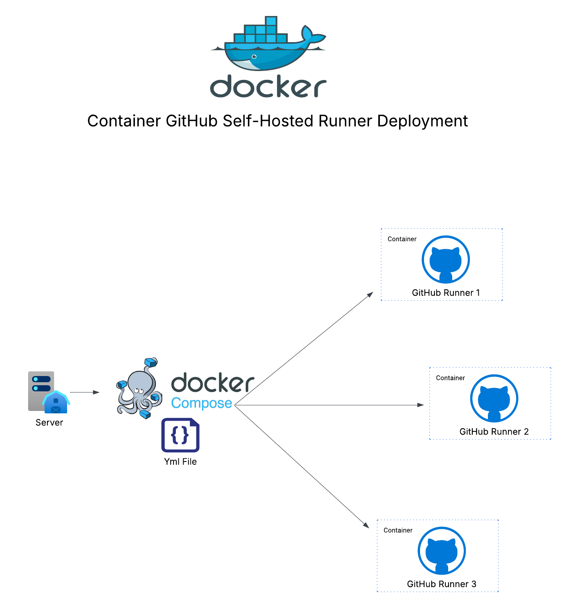

# 🏃‍♂️ Self-Hosted GitHub Runners (Multi-Container Setup)

<p align="center">
  
</p>

## 🚦 Overview

This project provides a scalable and containerized setup for running **self-hosted GitHub Actions runners** using Docker and Docker Compose. It is designed for developers, DevOps engineers, or teams who want:

* Full control over GitHub Actions runner infrastructure
* Fast, repeatable deployment of multiple runners
* Tight control over updates and runner versioning
* Lightweight health validation for container integrity

Whether you're a solo builder managing CI jobs on bare metal or a team coordinating across many services, this project makes it straightforward to scale out runners using a declarative, multi-container pattern.

Inspired by [`myoung34/docker-github-actions-runner`](https://github.com/myoung34/docker-github-actions-runner), this setup expands upon that base with multi-runner orchestration, `.env` configuration, and system validation via [`dgoss`](https://github.com/aelsabbahy/goss).

---

## ⚡ Prerequisites

* Docker Engine ≥ 20.10
* Docker Compose v2
* Linux (x86-64)

---

## 🔧 Key Features

* 🐳 **Containerized runners**: Each GitHub runner lives in its own Docker container.
* 🔁 **Parallelized scaling**: Launch 1 to N runners with a single command.
* 🛑 **Update control**: Auto-updates are intentionally disabled; upgrades occur via manual image rebuilds.
* 🏷️ **Custom labels**: Tag runners with labels to target specific workflows.
* 🧪 **Health checks**: Use `dgoss` to validate image integrity and config correctness.
* 🔧 **Environment-based config**: Tweak behavior via a simple `.env` file.

---

## 📁 Repository Structure

| File                 | Purpose                                                      |
| -------------------- | ------------------------------------------------------------ |
| `docker-compose.yml` | Defines the deployment of multiple runner containers         |
| `Dockerfile`         | Custom image builder with GitHub runner and permission fixes |
| `entrypoint.sh`      | Secure bootstrapping of each runner instance                 |
| `goss_full.yaml`     | System test spec (file existence, user, binaries, etc.)      |
| `goss_vars.yaml`     | Variables used for `dgoss` test context                      |
| `.env.example`       | Copy template for safe environment variable usage            |
| `.gitignore`         | Protects sensitive data from being committed                 |
| `README.md`          | Project documentation                                        |

---

## 🚀 Quick Start

### 1. Clone the Repository

```bash
git clone https://github.com/your-org/your-repo-name.git
cd your-repo-name
```

### 2. Configure Environment

Copy `.env.example` to `.env` and populate your GitHub details:

```env
RUNNER_TOKEN=your_generated_token
RUNNER_SCOPE=org
ORG_NAME=your_org_name
LABELS=linux-x64,self-hosted,custom
DISABLE_AUTO_UPDATE=true
DISABLE_AUTOMATIC_DEREGISTRATION=true
RUN_AS_ROOT=false
```

> ⚠️ Do NOT commit the `.env` file — secrets must stay local.

#### Getting a `RUNNER_TOKEN`

Use GitHub CLI:

```bash
gh auth login
gh api \
  /orgs/$ORG/actions/runners/registration-token \
  --method POST \
  --jq .token
```

For repository scope:
Change `/orgs/$ORG/` to `/repos/$OWNER/$REPO/`.

### 3. (Optional) Mount Host Volumes

To share local paths with your runners:

```yaml
volumes:
  - /var/run/docker.sock:/var/run/docker.sock
  - /your/host/path:/desired/container/path
```

---

## 🧪 Runner Health Validation

Install `dgoss` to verify that your runner images are configured correctly:

```bash
curl -L https://raw.githubusercontent.com/goss-org/goss/master/extras/dgoss/dgoss -o /usr/local/bin/dgoss && chmod +x /usr/local/bin/dgoss
```

Run a system test:

```bash
GOSS_VARS=goss_vars.yaml \
GOSS_FILE=goss_full.yaml \
GOSS_SLEEP=1 \
dgoss run --env-file .env \
  -e RUNNER_SCOPE=org \
  -e ORG_NAME=your_org_here \
  -e RUNNER_WORKDIR=/your/desired/workdir \
  -e DISABLE_AUTO_UPDATE=true \
  -e DISABLE_AUTOMATIC_DEREGISTRATION=true \
  your-runner-image-name
```

---

## 📦 Build & Launch

### Build the Custom Runner Image

```bash
docker build -t your-runner-image-name .
```

### Start All Runners

```bash
docker-compose up -d
```

You can also scale up runners easily:

```bash
docker compose up --scale runner=5 -d
```

---

## 📌 Operational Notes

* Each container independently registers as a GitHub runner
* Containers stopped with `docker-compose down` will retain their registration unless manually removed
* Runner names (`RUNNER_NAME`) are set dynamically (`runner-1`, `runner-2`, etc.)
* Update by rebuilding the image and restarting the stack

---

## 📄 License

MIT License — free to use, adapt, and extend.

---

## 🙏 Acknowledgements

* Base inspiration: [`myoung34/docker-github-actions-runner`](https://github.com/myoung34/docker-github-actions-runner)
* Health validation: [`dgoss`](https://github.com/aelsabbahy/goss)
